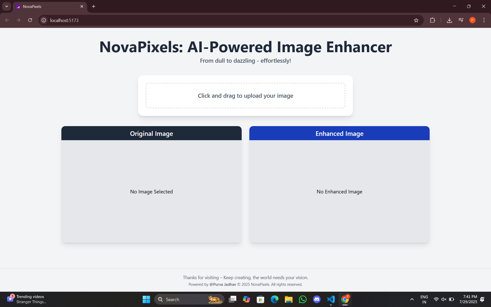

# NovaPixels: AI-Powered Image Enhancer 🚀🖼️

**NovaPixels** is a modern web application that uses AI to enhance images — turning dull visuals into vibrant, high-quality ones in just a few clicks. Built using **React**, **Tailwind CSS**, and animation with **Framer Motion**, this app is fast, responsive, and user-friendly.

---

## ✨ Features

- 📸 Drag-and-drop image upload
- ⚙️ AI-based enhancement (simulated or integrated via model)
- 🪄 Real-time preview of original vs enhanced image
- 💾 One-click download of the enhanced image
- 💻 Responsive and modern UI powered by Tailwind CSS and Framer Motion

---

## 🛠️ Tech Stack

- **Frontend:** React, Tailwind CSS, axios, Framer Motion
- **Tooling:** Vite, npm
- **Optional Integration:** AI image enhancer (external API - PicWish)

---

## 📷 Demo

> **Live Preview:** (https://novapixels.onrender.com/)

---

## 🙋‍♀️ Author 
**Purva Jadhav**